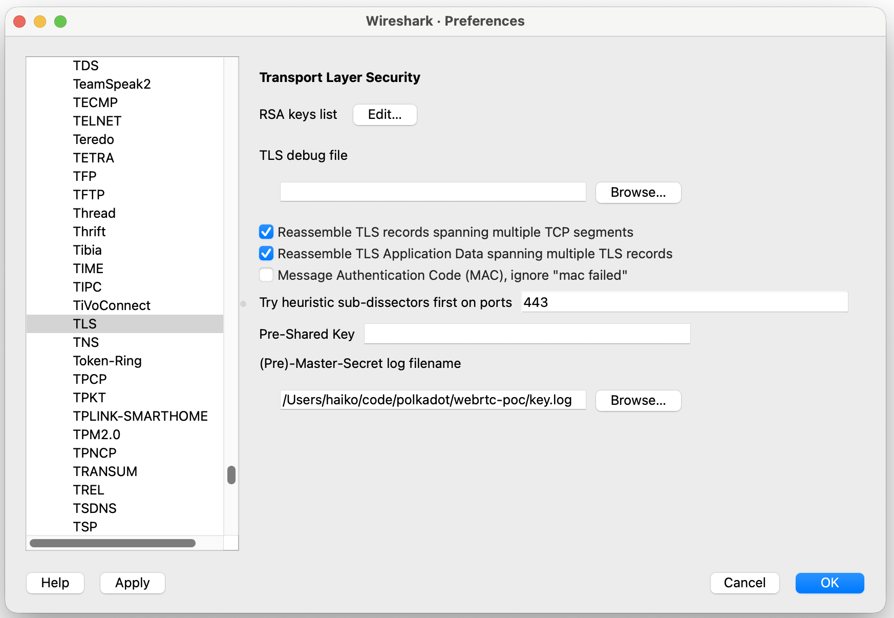
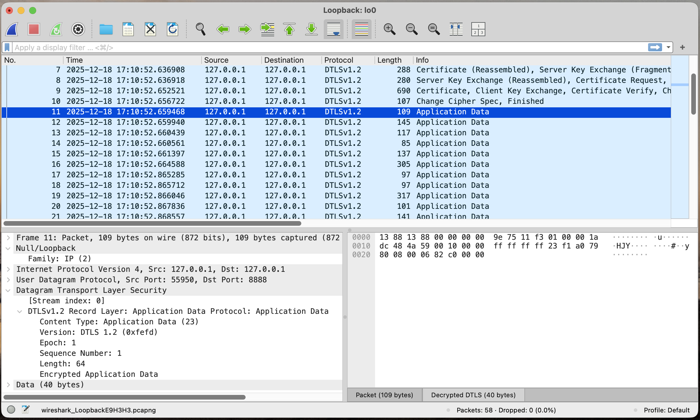
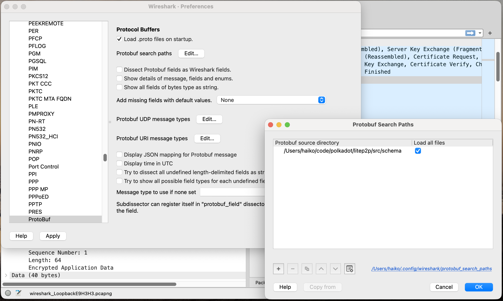
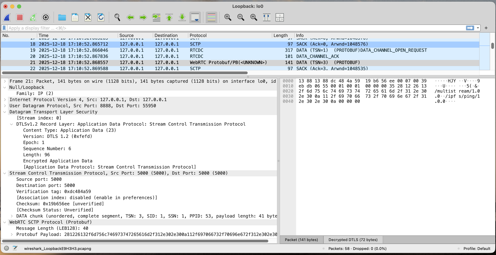

# Analyzing libp2p-webrtc Traffic with Wireshark

## Introduction

The libp2p-webrtc protocol stack is very complex. Because of this, debugging interoperability issues between two implementations can be very challenging and tedious. Being able to decode and inspect the network traffic in Wireshark can be very helpful. Wireshark already has built-in decoders for all but one protocol (UDP, SCTP, DTLS, WebRTC, ICE, STUN). There are just two issues that need to be addressed before it can be used for analyzing libp2p-webrtc traffic. The first one is decrypting DTLS payloads and the second one is the protobuf enveloped that is used inside WebRTC data channels.

## Decrypting DTLS

There is a de-factor standard for exporting (D)TLS key material to a file pointed to by the environment variable `SSLKEYLOGFILE`, originally introduced in Firefox. It was adopted by Chrome, OpenSSL and other TLS implementations and is in the process of [formalization into a proper standard at the IETF](https://datatracker.ietf.org/doc/draft-ietf-tls-keylogfile/).

### rust-libp2p/webrtc-rs

`rust-libp2p` uses [`webrtc-rs`](https://webrtc.rs/), which in turn uses [`rustls`](https://rustls.dev/). `rustls` supports exporting key material using the [struct `KeyLogFile`](https://docs.rs/rustls/0.23.35/rustls/struct.KeyLogFile.html). However, `webrtc-rs` does not instantiate this struct and therefore requires [a small patch](https://github.com/haikoschol/webrtc/commit/426ff1231f4dfb04fb4bbb868c86325d3340898c). This patched version of `webrtc-rs` then needs to be referenced in the `Cargo.toml` file of an executable that uses `rust-libp2p`, such as [`webrtc-poc`](https://github.com/haikoschol/webrtc-poc/tree/haiko-testing).

With Wireshark configured as described below and capturing on the loopback interface, start the server/listener:

```
$ RUST_LOG="info" cargo run --package litep2p-webrtc-poc-server
```

and the client/dialer:

```
SSLKEYLOGFILE=key.log RUST_LOG="info" cargo run --package webrtc-poc-client -- "$(cat peer_address.txt)"
```

### litep2p/str0m

`TODO`

### Chrome/Firefox

`TODO`

All that should be required is starting Chrome or Firefox with the `SSLKEYLOGFILE` environment variable set. However, when briefly testing this I was not able to decrypt the traffic in Wireshark, even though the key log file was written by the browsers.

### Configuring Wireshark

Once the key material is being exported, Wireshark needs to be told where to look for the file. This is straightforward to do in the Preferences dialog, under Protocols -> TLS.



If it works, DTLS packets will now have the tab "Decrypted DTLS" in the area showing the payload in the main window.



The last step is to tell Wireshark to decode the decrypted DTLS payload as SCTP. The WebRTC data inside it will be detected automatically. Doing this requires right clicking on a DTLS packet in the list and selecting SCTP in the dialog that opens.

## Decoding Protobuf Envelopes

This only requires adding a protobuf file that defines the schema in Wireshark in the Preferences dialog, under Protocols -> Protobuf.



Together with the above steps for decrypting DTLS, Wireshark should now be able to decode everything down to the payload of the protobuf envelope.


