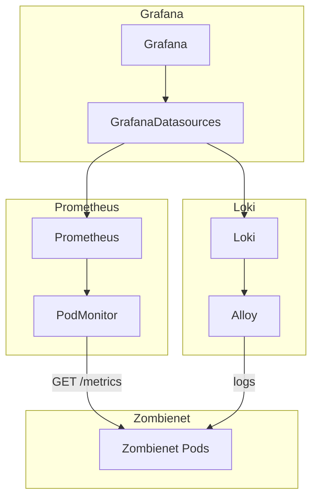

# Monitored Zombienet in a local Kubernetes cluster

## Overview

This directory contains Kubernetes mainfests intended to be used for development and testing in a locally running Kubernetes
cluster. The easiest way to run such a cluster is probably by installing
[Docker Desktop](https://www.docker.com/products/docker-desktop/) or [OrbStack](https://orbstack.dev/).

The manifests will set up a monitoring stack consisting of Prometheus for metrics, Loki for logs and Grafana as the user interface
to both. The monitoring stack is configured to discover and ingest metrics and logs from Kubernetes pods managed by
[zombienet](https://github.com/paritytech/zombienet).

The components involved and their relationship to each other are depicted in the following diagram:



## Installation

So far this setup has only been tested with OrbStack running on an Apple Silicon MacBook.

### Required

- [Docker Desktop](https://www.docker.com/products/docker-desktop/), [OrbStack](https://orbstack.dev/) or another method of running a Kubernetes cluster on your machine ([minikube](https://minikube.sigs.k8s.io/docs/start/), [kind](https://kind.sigs.k8s.io/), [k3s](https://k3s.io/), etc.)
- [zombienet](https://github.com/paritytech/zombienet)

### Recommended

- [k9s](https://k9scli.io/) (Terminal UI for Kubernetes)

In order for Prometheus to scrape metrics from zombienet pods, a `PodMonitor` Kubernetes resource needs to be created in the cluster.
Zombienet creates a `PodMonitor` resource when running `zombienet spawn`, but unfortunately it contains an invalid regex, causing it
to be ignored by Prometheus. I've [forked zombienet](https://github.com/haikoschol/zombienet), fixed the `PodMonitor` resource and
created a [binary for ARM Macs](https://github.com/haikoschol/zombienet/releases/download/v1.3.135/zombienet-macos-arm64). Alternative
to using that, you can [apply the fix](https://github.com/haikoschol/zombienet/commit/f7b352917a3ad76a0b05c23f8ab9524b8a9154ad) in a
clone of the upstream repository and run `npm run package:linux:x64` in the `javascript` directory to create a package in `javascript/bins`.

Either way, make sure that you can run the `zombienet` CLI. Also make sure that `kubectl` is in your path and configured to access the
local cluster.

```
$ kubectl get pods
No resources found in default namespace.
```

Once that is the case, you can start `k9s` to get a nice view of the resources in the cluster. Typing `:` followed by the resource
you are interested in plus return shows a list of e.g. `namespaces`, `pods`, `services`, etc.

Now apply the manifests in the following order, using the command `kubectl apply -f <manifest>.yaml`:

1. `monitoring-service-account.yaml`
1. `prometheus-operator.yaml` (observe pods in the `monitoring` namespace to make sure they start correctly, either in `k9s` or with `kubectl -n monitoring get pods`)
1. `prometheus-instance.yaml` (this should create a pod called `prometheus-prometheus-0` plus a few more resources)
1. `loki-stack.yaml` (pods with prefixes `loki-` and `alloy-`, a deployment called `loki` and a daemonset called `alloy`, plus a few configmaps)
1. `grafana-operator.yaml` (again, wait for new pods to come up)
1. `grafana-instance.yaml`
1. `grafana-datasources.yaml`

Now you should be able to create a port forwarding to the Grafana service, either with `k9s` or with
`kubectl port-forward --namespace monitoring service/grafana-service 3000:3000`, and access the web interface at http://localhost:3000.

## Usage

Just launch a zombienet and the data should show up in Grafana. This directory includes an example with two relay chain and one parachain node:

```
$ zombienet spawn zombies.toml
```

## TODO

- Create/import dashboards
